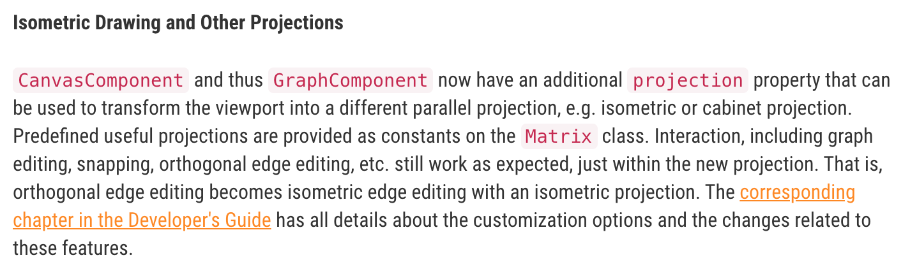
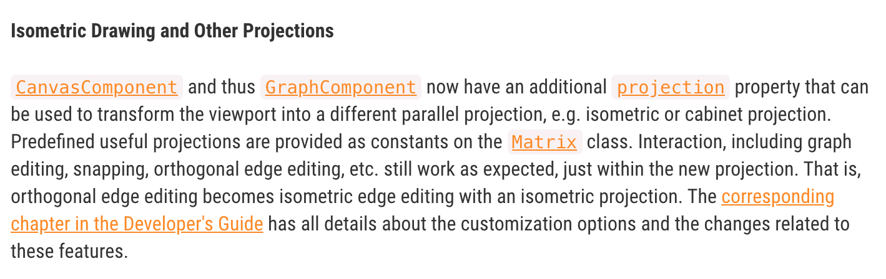

# yLink

## Problem
No documentation links for yFiles classes on following pages:
* https://www.yworks.com/products/yfiles-for-html/release-notes
* https://www.yworks.com/products/yfiles-for-html/changelog

## Installation
1. Open `chrome://extensions/`
2. Enable "Developer mode"
3. Click "Load unpacked extension…"
4. Select the extension’s directory
5. PROFIT

## Before

## After

